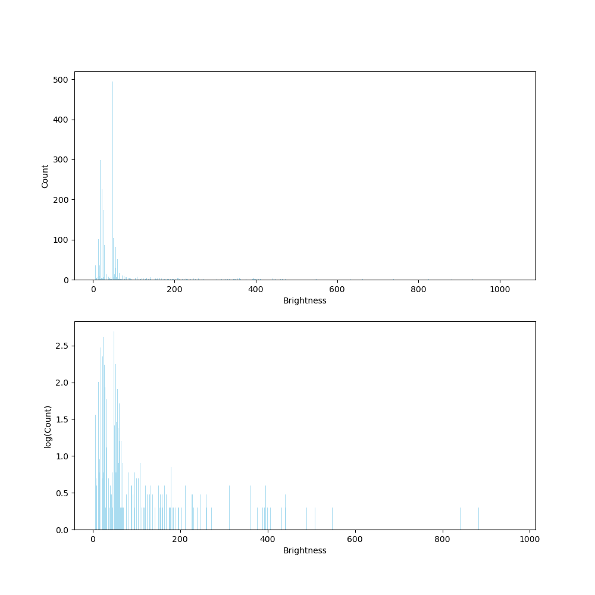
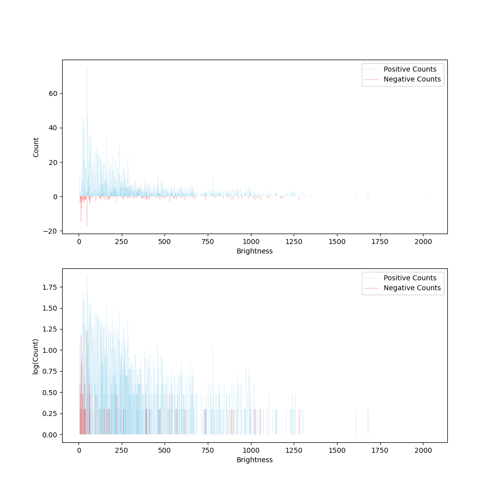
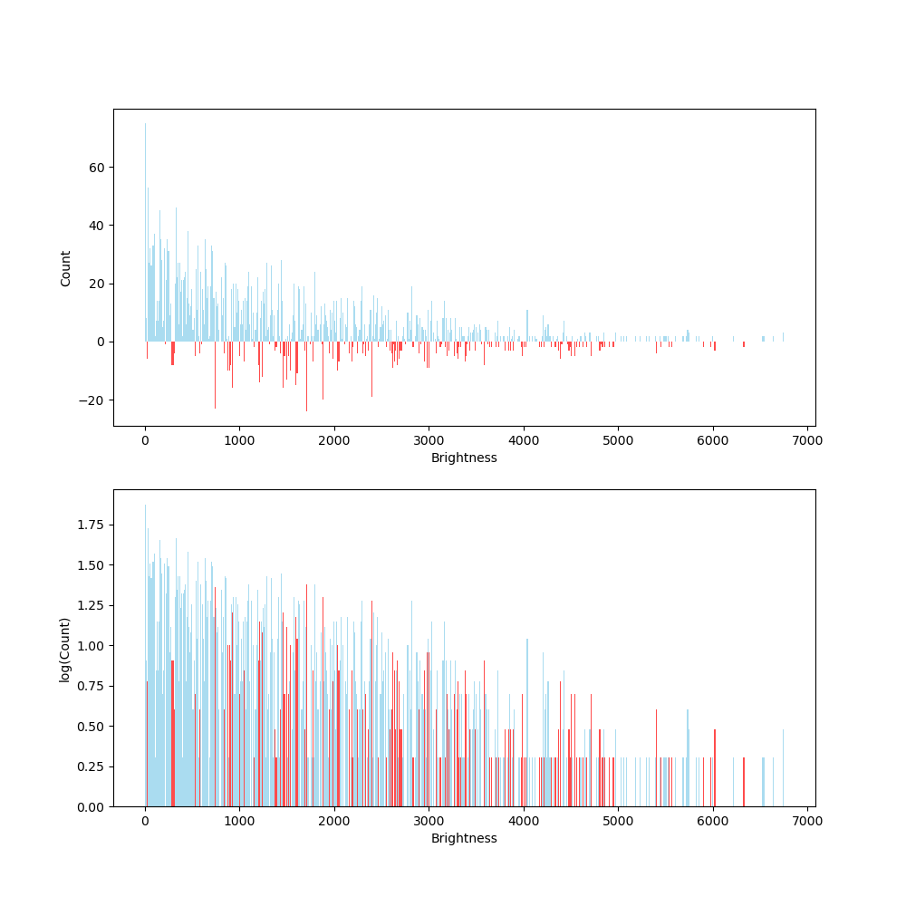

# Web cameras as photon-counting X-ray detectors

## Week 3 - Trust web camera
- distance x-ray tube - camera = (74 $\pm$ 0.1) cm
- thickness of Al: (1.2 $\pm$ 0.1, 2.2 $\pm$ 0.1, 3.0 $\pm$ 0.1, 4.2 $\pm$ 0.1, 5.05 $\pm$ 0.1, 10.1 $\pm$ 0.1, 14.4 $\pm$ 0.1, 20.5 $\pm$ 0.1, 30.3 $\pm$ 0.1, 40.3 $\pm$ 0.1, 60.5 $\pm$ 0.1) mm

## Week 4

### Trust web cam
- distance x-ray tube - camera = (74 $\pm$ 0.1) cm

### Basler ace U acA2440-35uc
- resolution: 2456x2052
- Pixel Format: Mono 8 - not really useful as it is achieved via an algorithm (https://docs.baslerweb.com/pixel-format#mono-formats)
- Exposure Time 29.0 microseconds
- FPS: 35.7
- Record a frame every 21 Milliseconds
- Stop recording after: 2 seconds
- Output format: Bitmap
- Recording buffer size: 100 frames

## Week 5

### Basler ace U acA2440-35uc
- resolution: 2456x2052
- Pixel Format: RGB8
- Exposure Time 29.0 microseconds
- FPS: 35.7
- Record a frame every 21 Milliseconds
- Stop recording after: 2 seconds
- Output format: Bitmap
- Recording buffer size: 100 frames

- Distance x-ray tube - metal foil $= (10 \pm 1)$ cm
- Distance camera - metal foil $= (23 \pm 1)$ cm
- Distance camera - x-ray tube $= (19 \pm 1)$ cm

=> $\theta \approx 55.7 \degree$ (angle between the ingoing "beam" and the camera)

#### No metal foil (sum of r, g and b pixels)

Figure: Data corrected for the dark current

Figure: Histogram with bin width = 1 (not all points are visible as a single bin is far too narrow)

Figure: Histrogram with bin width = 10

In these figures, two peaks are visible that correspond to the tungsten (W) emission lines at energies $9.67$ keV and $\sim 8.40$ keV (https://www.horiba.com/fileadmin/uploads/Scientific/Documents/XRay/emission_lines.pdf).

To determine the brightness values corresponding to these peaks, spectral peak interpolation is required (to be implemented in the future). For now, the approximate brightness values are:

- $9.67 ~\text{keV} : ~ 48$
- $\sim 8.40 ~\text{keV} : ~ 22$

#### Ag (sum of r, g and b)

Figure: Data corrected for the dark current

Figure: Histogram with bin width = 10

Although a broad peak appears at a brightness of ∼250, it becomes more apparent when the data without the metal foil is subtracted from the data with the foil.

Figure: Filtered data

Figure: Filtered data with bin width = 10

The first peak (with two higher side peaks) is likely due to Bremsstrahlung and the scattering of tungsten emission radiation, which shifts the emission lines towards higher energies.

The second peak, centered at a brightness of ∼224, corresponds to the silver (Ag) emission line:

- $22.16 ~\text{keV} : ~224$

#### Au (sum of r, g and b): similar methode

Figure: Filtered data

Figure: Filtered histogram with bin width = 10

No new peaks are visible => more complex analysis is needed.

#### Cu (sum of r, g and b)

Figure: Filtered data

Figure: Filtered histogram with bin width = 10

A new peak is visible at a brightness of ~104, but it also appears in the case of Mo (Bremsstrahlung?).

#### Mo (sum of r, g and b)

Figure: Filtered data

Figure: Filtered histogram with bin width = 10

New peaks observed at ~104 and ~160:

- $17.48 ~\text{keV} : ~160$

#### Linear regression

Only the peaks that are clearly visible without further analysis are considered.

Figure: linear regression of basler measurements week 5

$E(\text{keV}) = (0.069 \pm 0.002)b + (6.62 \pm 0.25)$ (approximate),

with b = brightness.

## Week 7

### Basler ace U acA2440-35uc
- resolution: 2456x2052
- Pixel Format: BayerRG12
- Exposure Time 29.0 microseconds
- FPS: 35.7
- Record a frame every 21 Milliseconds
- Stop recording after: 4 seconds
- Output format: Bitmap
- Recording buffer size: 100 frames

Setup: similar to week 5, but no measuremnets were taken

Peaks at 48 and 22 due to tungsten, as in week 5. Below, we mention only result with "clear" peaks

#### Ag (sum of r, g and b)

- $22.16 ~\text{keV} : ~232$

#### Mo

- $17.48 ~\text{keV} : ~164$

#### Linear regression

$E~(\text{keV}) = (0.066 \pm 0.002)b + (6.72 \pm 0.21)$

These measurements yield the same results, but the peaks are harder to spot as there are some additional peaks at higher energies.

### Trust webcam

#### W

- $8.40 ~\text{keV} : ~12$
- $9.67 ~\text{keV} : ~42$

#### Ag

- $22.16 ~\text{keV} : ~1259$

#### Au

#### Cu

#### Mo

- $17.48 ~\text{keV} : ~1042$

#### Ta

#### Linear regression

$E(\text{keV}) = (0.0098 \pm 0.0013)b + (8.6 \pm 1.0)$

## Week 8

### Basler ace U acA2440-35uc
- resolution: 2456x2052
- Pixel Format: BayerRG12
- Exposure Time 15000.0 microseconds
- FPS: 35.7
- Gain: 13 dB
- Record a frame every 21 Milliseconds
- Stop recording after: 4 seconds
- Output format: Bitmap
- Recording buffer size: 500 frames

#### Transmission and attenuation
- l = (41 $\pm$ 1) cm

#### Reflection

## Week 10

### Basler ace U acA2440-35uc
- resolution: 2456x2052
- Pixel Format: BayerRG12
- Exposure Time 300.0 microseconds
- FPS: 35.7
- Gain: 13 dB
- Record a frame every 21 Milliseconds
- Stop recording after: 4 seconds
- Output format: Bitmap
- Recording buffer size: 500 frames

#### Transmission and attenuation
- l = (32 $\pm$ 1) cm

